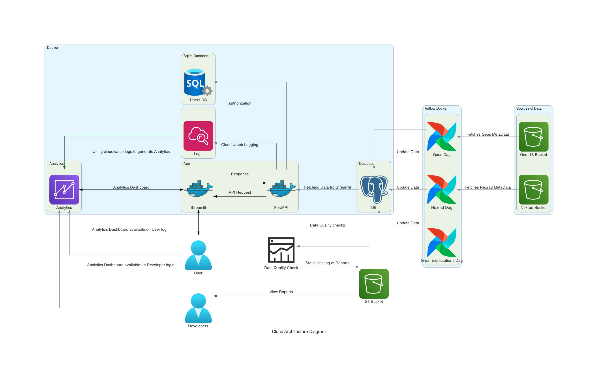

# Diagrams

[Diagrams](https://diagrams.mingrammer.com/) lets you draw the cloud system architecture in Python code.


Documentation - https://diagrams.mingrammer.com/docs/getting-started/installation

## Install dependency

Graphviz

```bash
sudo apt install graphviz
```

Diagrams -
Create virtual environment and activate it.
inside virtual environment

```bash
pip install diagrams
```

## Tutorials

1. Requires reading and knowledge about following concepts:

   - Diagrams - Diagram is a primary object representing a diagram.
   - Nodes - Node is a second object representing a node or system component.
   - Cluster - Cluster allows you group (or clustering) the nodes in an isolated group.
   - Edges - Edge is representing an edge between Nodes.

2. Create a python script [arch3.py](arch3.py)

3. Generate the image

   ```bash
   python arch3.py
   ```
   
 The image gets generated in the current working directory(arch-diag)
 
   <!-- <imag src="cloud_architecture_diagram.png" width="300" height="300" /> -->
 
   